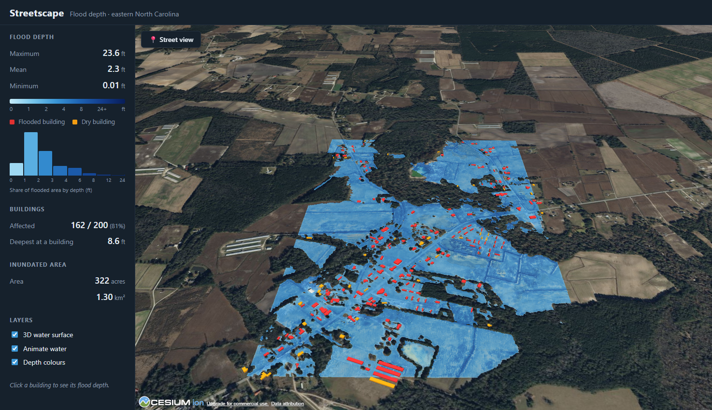
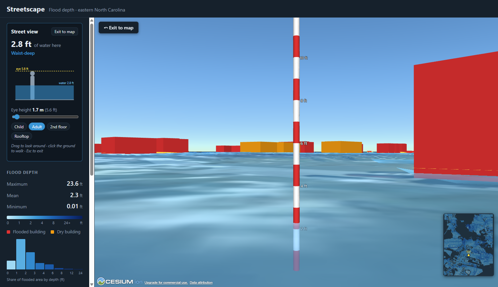
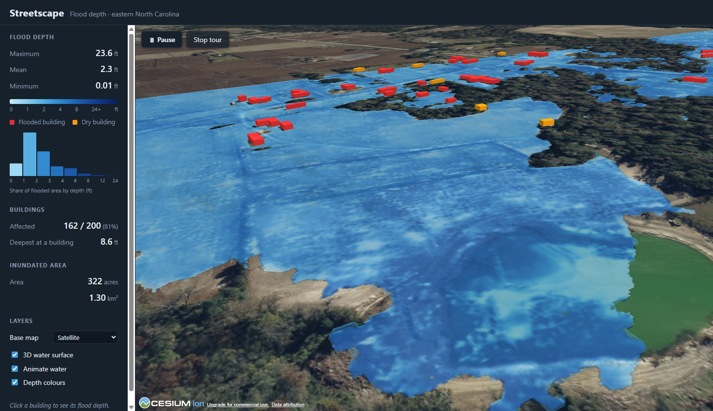

# Streetscape

**A 3D immersive floodwater depth dashboard with simulated street-level views.**

Streetscape shows what a flood looks like *from where you stand*. It renders a
predicted flood depth raster and building footprints as a georeferenced 3D scene
in the browser, then lets you drop into any spot at eye level, look around 360°,
and raise your viewpoint from a child's height to a rooftop.

Study area: **Hanchey Store, eastern North Carolina** (~322 acres inundated, 200 buildings).



*Aerial view — the water surface carries the depth colours; red buildings are flooded, orange are dry.*



*Street view — standing in 2.8 ft of water. The staff reads the depth in the scene, and the
yellow water marks show where the flood reaches on the buildings across the street.*



*Fly-through — the tour follows the deep channel across the study area.*

---

## What it does

- **3D flood surface** — an animated water mesh built at *ground + depth*, so buildings
  rise out of the water instead of sitting on a painted blue polygon.
- **Depth-coloured water** — the water surface *is* the depth map: every point takes its
  colour from the depth grid, and deeper water is more opaque. The flood raster can also be
  draped on the ground underneath. Both share one legend.
- **Buildings in 3D** — 200 footprints extruded to estimated heights; red = flooded,
  orange = dry. Click one for its depth, height and year built.
- **Street view** — stand anywhere, drag to look around, click the ground to walk,
  and slide your eye height from 0.5 m to 30 m.
- **Flood staff** — a surveyor's depth pole in red and white 1 ft bands stands 5 m ahead of
  you and follows your view as you turn, so the water level can be read straight off the scene.
- **Water marks** — a bright line around each flooded building at its own water level, the
  mark a real flood leaves on a wall, so depths can be read across the street at a glance.
- **Replay flooding** — the water drops below ground and rises back to full depth over four
  seconds. At eye level you watch it climb the staff.
- **Water-line gauge** — shows where the water would reach on a standing adult
  ("knee-deep", "chest-deep"), and marks the view as underwater when your eye drops below
  the surface.
- **Bird's-eye fly-through** — a smooth tour that follows the flood channel at ~120 m,
  banking into turns. The path is derived from the deepest raster cells, not hand-drawn.
- **Base maps** — satellite, satellite with labels, OpenStreetMap or plain terrain.
- **Summary statistics** — depth range, inundated area, affected buildings, and a
  histogram of flooded area by depth band.

## Running it

Requires **Node 18+** and a free [Cesium ion](https://ion.cesium.com) account.

```bash
cd web
cp .env.example .env     # then paste your Cesium ion token into .env
npm install
npm run dev              # http://localhost:5173
```

`npm run build` produces a static site in `web/dist` — no backend required.

## Data pipeline

The Python scripts in `prep/` turn the raw inputs into static files the web app
reads. They only need to be re-run when the source data changes.

| Script | Output | Purpose |
|---|---|---|
| `prep/building_depth.py` | `buildings.geojson`, `buildings_depth.gpkg` | Flood depth per building (zonal statistics), metric conversions |
| `prep/make_stats.py` | `stats.json` | Summary statistics and the depth histogram |
| `prep/make_overlay.py` | `flood_depth.png`, `flood_overlay.json` | Colour-ramped overlay reprojected to WGS84, plus bounds and legend |
| `prep/make_depth_grid.py` | `depth_grid.json` | ~12.5 ft depth grid for point queries and the water mesh |
| `prep/make_tour_path.py` | `tour_path.json` | Centreline of the deep channel, used as the fly-through path |

Run them in that order with a Python environment that has `rasterio`, `geopandas`,
`numpy` and `pillow`:

```bash
python prep/building_depth.py
python prep/make_stats.py
python prep/make_overlay.py
python prep/make_depth_grid.py
python prep/make_tour_path.py
```

### Inputs

| Dataset | Notes |
|---|---|
| `data/raster/depth.tif` | Flood depth model output. EPSG:2264 (NC State Plane, US survey feet), 3.125 ft cells, depth in **feet**, 0.01–23.6 ft |
| `data/building_footprint/` | NC Emergency Management building inventory (`S_BUILDING_FP`, 2020), same CRS |

### Two decisions worth knowing

**Building heights are estimated.** The source layer has no height field —
`LIDAR_LAG` / `LIDAR_HAG` are *ground* elevations, not building heights. Heights come
from the ratio of heated floor area to footprint area (≈ number of storeys), capped at
2 storeys, with six outliers corrected by hand against imagery. The result is stored in
the `estimate_h` field (feet).

**Everything is positioned relative to the terrain.** The raster stores *depth*, not
water surface elevation, so buildings and water are placed relative to Cesium World
Terrain rather than to absolute elevations. This avoids mixing vertical datums
(NAVD88 vs WGS84 ellipsoid, ~35 m apart in North Carolina) and removes the need for a
custom DEM. Because Cesium's terrain is coarser than the model's DEM, the computed
water surface is lightly smoothed so it reads as flat water.

## How a few parts work

**The water surface** is a mesh, not a flat polygon. Each grid point is placed at
*Cesium's ground height + depth*, so the surface follows the terrain. Because Cesium's
terrain is not the model's DEM, the result is lightly smoothed to read as flat water, and
dry points at the edge are pushed below ground so the terrain cuts a natural shoreline.
Its colour comes from a texture painted from the depth grid at load time, sampled by a
custom version of Cesium's water shader — so ripples, reflections and depth colours are
the same surface.

**The flood staff** is anchored to the camera rather than the ground: every frame its
position is recomputed 5 m along the current heading, which keeps it centred while you turn.
The **replay** works because the water is a single mesh — sliding one transform moves the
whole flood up or down.

**Street view** disables Cesium's normal camera controls and drives the camera directly:
stand at ground + eye height, drag to turn, click the ground to walk. Cesium does not draw
the water surface from below, so when your eye goes under the water line the view is tinted
and labelled rather than appearing dry.

**The fly-through path** is derived from the data: the cells deeper than a share of the
maximum are projected onto their principal axis (the direction the channel runs), and the
median position of each slice becomes a waypoint. The camera follows a Catmull-Rom spline
through those points and banks into the turns.

## Project layout

```
data/
  building_footprint/   source shapefile
  raster/depth.tif      source flood depth raster
  processed/            pipeline output, consumed by the web app
prep/                   Python data preparation scripts
web/
  src/cesium/           Cesium layers: buildings, overlay, water mesh, street view camera,
                        flood staff, water marks, fly-through tour
  src/components/       React UI: stats panel, controls, street view card, minimap, histogram
  src/data/             depth grid loader and point lookup
```

## Tech

CesiumJS · React · Vite · Python (rasterio, GeoPandas) · Cesium ion World Terrain and imagery

## Possible extensions

- Time-series animation of rising and falling water
- Scenario comparison between return periods (10 / 100 / 500-year)
- Damage estimates from depth-damage curves
- Shareable links that encode camera position and eye height
